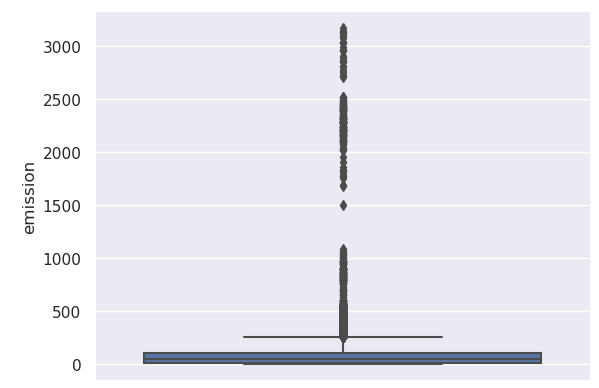
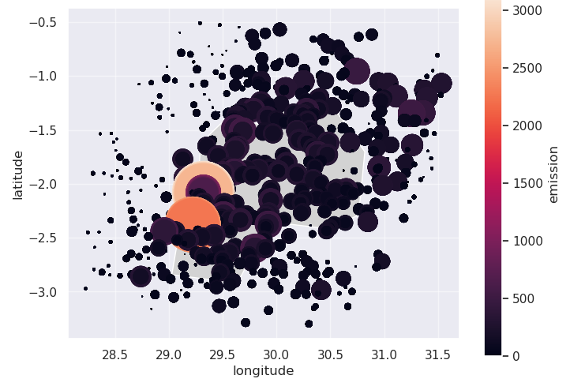
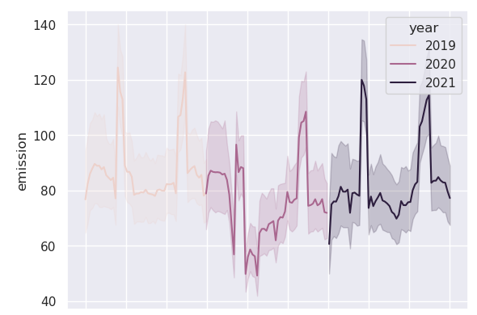

# kaggle_rwanda_emissions
Kaggle competition to predict CO2 emissions in Rwanda

## Goal
- Create a model to predict future CO2 emissions using open source data from Rwanda

## Outcome
- 
|feature|importance %|
|-|-|
|latitude|0.444169|
|longitude|0.463098|
|year|0.003846|
|week_no|0.008523|

# EDA
Large outliers where massively more emissions were recorded could skew the model

Visualizing where most carbon emissions occured by mapping mean emissions to longitude / latitude coordinates. Color and size both correlate to the amount of emissions over the entire time period

Visualizing emissions over time reveals a somewhat cyclical pattern where emissions are highest in May and November.

## Feature engineering / data cleaning
- The dataset contained some missing values. Where values were missing for most observations (UvAerosol*), features were dropped. For others where only a fraction of observations were missing, I used SkLearn's SimpleImputer to impute missing values with the mean.
- Dropped non-numerical features such as the ID_LAT_LON_YEAR_WEEK feature, which is just an ID generated from other features, as well as the year_week feature which was replaced by a datetime feature

## Model building
I tried three different models (Decision Tree, Linear Regression, Random Forest Regressor). I didn't expect the linear model to do well due to the nature of the data, which was confirmed when running the model. I then repeated this three times: Once for all the data, once for data without outliers beyond 99.5% of range of values, and one only containing only the most important features from the previous two runs: Latitude, Longitude, Year, Week.

## Model performance
The Random Forest outperformed the single Decision Tree by a small margin in every version. I used mean squared error for evaluation because it gives us a good idea as to how close we are to the actual values and in this particular problem we want accurate predictions:
| | Without outliers | With outliers | Only most important features |
|-|-|-|-|
|Decision Tree|26.6|38.7|17.5|
|Random Forest|19.1|27.6|**13.3**|

## Conclusion
- Using a Random Forest with only longitude, latitude and the date led to the best outcome.
- Some questions about the data came up during the work on this problem: For example, the large outliers, as well as the cyclical spikes in emissions around certain times. In a real-world scenario, it would be worth exploring this with subject matter experts to understand the data better and ensure no inaccurate measurements make it into the final model.

